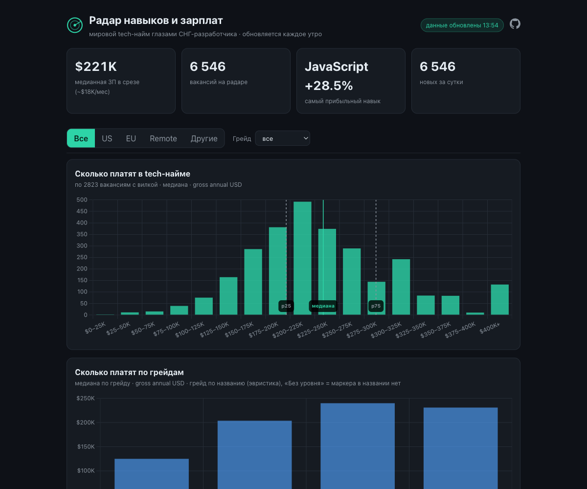
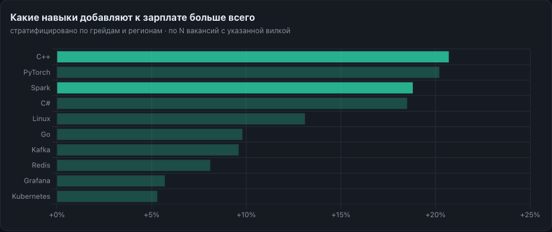
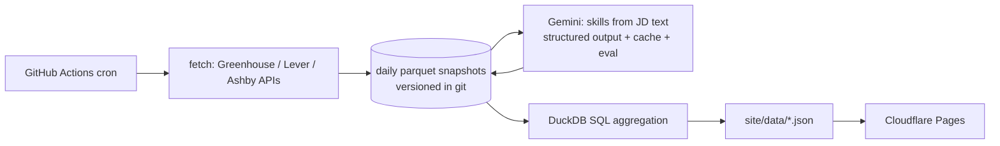

# tech-salary-radar

**Self-updating dashboard of the global tech job market — what skills companies hire for and how much they pay. Rebuilds itself every morning for $0/month.**

[](https://github.com/midat-fx/tech-salary-radar/actions/workflows/pipeline.yml)
[](https://github.com/midat-fx/tech-salary-radar/actions/workflows/ci.yml)


[](LICENSE)

**→ Live dashboard (RU):** _link added after first Cloudflare Pages deploy._




## What it does

- Pulls open engineering / data / product-tech roles every morning from the **public career-board APIs** (ATS) of ~300 tech companies — Greenhouse, Lever, Ashby.
- Normalizes pay to **annual gross USD**, tags region and seniority, and uses an LLM to extract the technology stack from each job description.
- Shows medians by grade & region, the most in-demand skills, and — the flagship — **which skills add the most to salary**, stratified to control for grade and region confounding.

The dashboard is in Russian, aimed at CIS developers: *what to learn and how much it pays.*

## Architecture



## Engineering highlights

- **Multi-source ETL** over three ATS APIs with a single normalized schema, polite crawling (one request per board, backoff, dead-board tolerance).
- **LLM structured output** (Gemini, enum-constrained JSON) to extract a canonical skill catalog from free-text JDs — **cached** (never re-extracted) with a **mini-eval gate** (micro-F1 ≥ 0.75 in CI).
- **Parquet history versioned in git** — the whole dataset is downloadable and recomputable; no database to run.
- **DuckDB** analytics straight over the parquet partitions.
- **$0/month infrastructure:**

  | piece | service | tier |
  |---|---|---|
  | scheduling / compute | GitHub Actions | free |
  | hosting | Cloudflare Pages | free |
  | skill extraction | Gemini flash-lite | free tier |
  | storage | git (parquet) | free |

## Data & methodology

- **Salary** is annual **gross** USD. Intervals are annualized (hourly ×2080, weekly ×52, monthly ×12); non-USD is converted daily. Midpoint = `COALESCE((min+max)/2, min, max)`. Rows outside $10k–$1.5M are dropped as parse errors.
- Only jobs **with a stated salary band** feed the salary charts — labeled *"по N вакансий с указанной вилкой."* Salary bands are dense on Ashby and sparse elsewhere (US pay-transparency), so the current base skews US; the EU stratum fills in as data grows.
- **Skill premium** is stratified by **grade × region** to avoid confounding a skill's value with where/at what level it appears.
- **Management roles** (Manager/Director/VP/…) are excluded from all salary statistics.
- **Seniority** is a heuristic from the job title; roles with no level marker are a separate `Без уровня` bucket (not merged into mid).
- **Survivorship bias:** ATS boards expose only currently-open roles, so historical "new by publish date" reflects only still-open jobs.
- **Download the data:**
  ```bash
  duckdb -c "SELECT seniority, median(salary_mid_usd) FROM read_parquet('data/snapshots/*/part.parquet') WHERE has_salary AND NOT is_management GROUP BY 1"
  ```

## Run locally

```bash
pip install -e ".[dev]"
python -m etl.cli run --skip-llm    # fetch boards -> parquet (skip the LLM step)
python -m etl.cli aggregate         # parquet -> site/data/*.json
python -m http.server -d site 8080  # open http://localhost:8080
```

## Roadmap

- Remote-first slice via Remotive / Arbeitnow.
- More ATS (Workday, SmartRecruiters, Recruitee) and a broader skill catalog (Rust, Scala, Ruby, Swift, dbt, Snowflake).
- Product & design role slices; per-country breakdowns; light theme; EN dashboard.

## License

MIT © Midat Faizov
